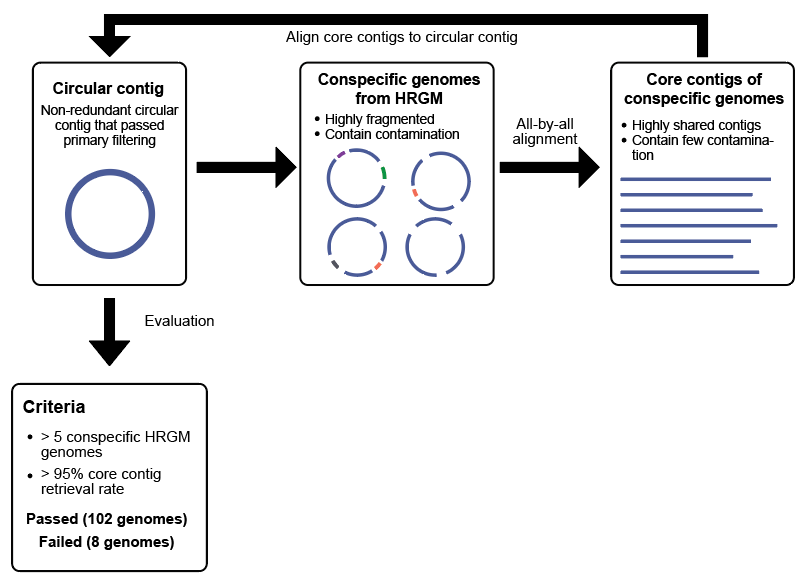

# cMAGfilter
Filtering faulty circularized genome using conspecific MAGs.

### Workflow introduction
Reconstruction of the circularized genomes is the ultimate goal of prokaryotic genome assembly. The development of accurate long-read sequencing technology enables the assembly of circularized genomes from highly complex metagenomic samples. However, prokaryotic genomes tend to have many repetitive sequences, and those often result in faulty assembly closing, thereby generating circularized genomes with significant gaps. cMAGfilter filters out the circularized metagenome-assembled genomes (cMAGs) with such gaps using their conspecific MAGs. For a given cMAG and its conspecific MAGs, it first searches core contigs, the contigs shared by most of the conspecific MAGs, from conspecific MAGs. Next, it calculates the core contig retrieval rate from the cMAG and filters out the cMAG using the information.



### Requirements
The package is tested on Linux operating systems (Linux: Ubuntu 20.04 LTS).
cMAGfilter requires Python>=3.6 and [mummer4](https://mummer4.github.io/) package.
You can install mummer from its [tarball](https://github.com/mummer4/mummer/releases) or from [bioconda](https://bioconda.github.io/recipes/mummer4/README.html?highlight=mummer4#package-package%20&#x27;mummer4&#x27;).
Please locate the mummer4 package softwares in PATH or specify the location with -nuc parameter.

### Setting up cMAGfilter
``` bash
git clone https://github.com/netbiolab/cMAGfilter.git
cd cMAGfilter
python3 setup.py install --user
```
The installation only takes a few minutes.

### Testrun with example input data
``` bash
python3 cMAGfilter.py examples/input/circular_contigs/Akkermansia_muciniphila.fna examples/input/conspecific_MAGs/Akkermansia_muciniphila examples/output/Akkermansia_muciniphila
```

The testrun was performed under the following system, using only single core.
- OS: Ubuntu 20.04 LTS (Windows Subsystem for Linux 2.0)
- CPU: 12th Gen intel(R) Core(TM) i7-12700H 2.3Ghz
- RAM: 8GB

System usage
- Running time: 6 min 20 sec
- Peak RAM usage: 135MB

Using multiple cores will reduce the running time. The number of conspecific genomes affects the runtime and peak memory usage, roughly in proportion with the square of # conspecific genomes.

### Output data and the format
You can find the example output files from 'examples/output/Mesosutterella_multiformis'.
- `all_by_all_alignment_results/`
  This directory contains all-by-all nucmer alignment results between conspecific MAGs.
- `[circular-contig]_align_back_results/`
  This directory contains core contigs to circular contig nucmer alignment results.
- `conspecific_genomes.contig_report.tsv` contains the information on whether the contigs of a conspecific MAG are founded from the other conspecific MAGs.
- `[circular-contig]_core_contigs_alignment.core_contig_stat.tsv` contains the list of core contig and their alignment result against circular contig.
- `core_contigs.fna` is FASTA sequence file of core contigs.
- **`[circular-contig]_core_contigs_alignment.summary.tsv`** This is the final result file.
> 1. circular contig name
> 2. circular contig alignment length
> 3. circular contig length
> 4. circular contig alignment coverage (2. / 3.)
> 5. core contig alignment length
> 6. core contig length
> 7. core contig alignment coverage (5. / 6.)
> 8. aligned core contig count
> 9. core contig count
> 10. **core contig retrieval rate (8. / 9.)**: In the paper, we considered the core contig is genuine if the core contig retrieval rate is higher than 0.95. Therefore, in this example case, we filter out the Mesosutterella_multiformis's core contig as its core contig retrieval rate is 0.867.


### Publication dataset
The entire 110 HiFi circular contigs and thir conspecific MAGs used in the paper are available from the [link](http://netbiolab.org/wiki/pubfiles/HiFi_publication_dataset.tar.gz) (6.6GB).

### Citation
CY Kim, J Ma, I Lee, [HiFi Metagenomic Sequencing Enables Assembly of Accurate and Complete Genomes from Human Gut Microbiota](https://www.biorxiv.org/content/10.1101/2022.02.09.479829v1), bioRxiv preprint, Feb. 2022
